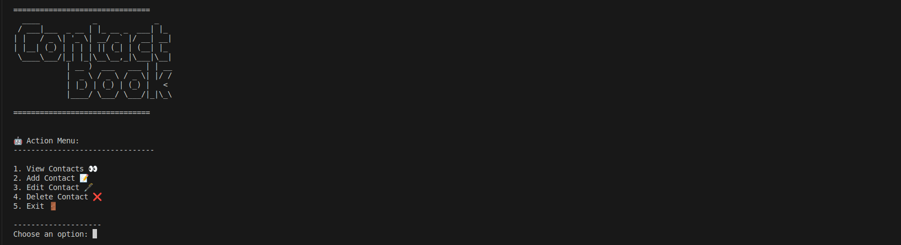

# Contact Book



Welcome to the Contact Book!
This is a simple interactive terminal application where you can manage your contacts.
It helps you practice JavaScript concepts such as objects, arrays, functions, loops, conditionals, and user input handling.

---

## Features

- View all contacts
- Add new contacts
- Edit existing contacts
- Delete contacts
- ASCII art for an enhanced user experience

---

## Getting Started

### Prerequisites

- Node.js (version 12 or higher)
- npm (Node Package Manager)

### Installation

1. Clone the repository to your local machine:

   ```sh
   git clone <GITHUB CLONE LINK>
   ```

2. Navigate to the project directory:

   ```bash
   cd contact-book-terminal
   ```

3. Install the required dependencies:

   ```bash
   npm install
   ```

### Running the Application

To start the Contact Book, run the following command in your terminal:

```bash
npm start
```

### How to Use

1. The application will display a welcome message with ASCII art.
2. You will see a menu with the following options:
   - 1. View Contacts
   - 2. Add Contact
   - 3. Edit Contact
   - 4. Delete Contact
   - 5. Exit
3. Enter the number corresponding to your choice and follow the prompts.

### Example

```bash
===============================
  ____            _             _
 / ___|___  _ __ | |_ __ _  ___| |_
| |   / _ \| '_ \| __/ _` |/ __| __|
| |__| (_) | | | | || (_| | (__| |_
 \____\___/|_| |_|\__\__,_|\___|\__|
            | __ )  ___   ___ | | __
            |  _ \ / _ \ / _ \| |/ /
            | |_) | (_) | (_) |   <
            |____/ \___/ \___/|_|\_\

===============================


🤖 Action Menu:
--------------------------------

1. View Contacts 👀
2. Add Contact 📝
3. Edit Contact 🖋️
4. Delete Contact ❌
5. Exit 🚪

--------------------
Choose an option:
```

---

## Code Explanation

- The code is written in JavaScript using modern ES6+ syntax.
- The `readline-sync` package is used to handle user input in the terminal.
- Here's a brief overview of the main parts of the code:

- **Importing readline-sync**: The `readline-sync` module is imported using ES6 `import` syntax.
- **ASCII Art**: The `appTitle` constant contains the ASCII art for the application title.
- **Menu Display**: The `showMenu` function displays the main menu options.
- **CRUD Operations**:
  - `viewContacts` function displays all contacts in the contact list.
  - `addContact` function allows the user to add a new contact to the list.
  - `editContact` function allows the user to edit an existing contact in the list.
  - `deleteContact` function allows the user to delete a contact from the list.
- **Main Function**:
  - `startContactBook` function contains the main loop that runs the application, displaying the menu and handling user input based on their choices.

---

## Contributing

Contributions are welcome!
If you have any ideas for improvements or new features, feel free to fork the repository and submit a pull request.

---

## License

This project is licensed under the MIT License.

---

Enjoy managing your contacts with the Contact Book!
If you have any questions or need further assistance, feel free to reach out.

Happy coding! 🚀
